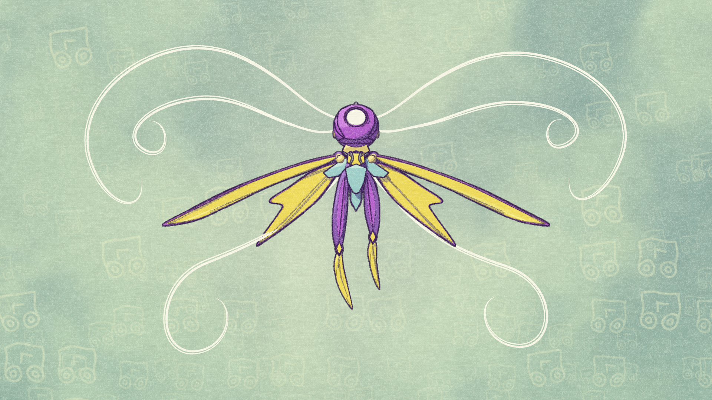
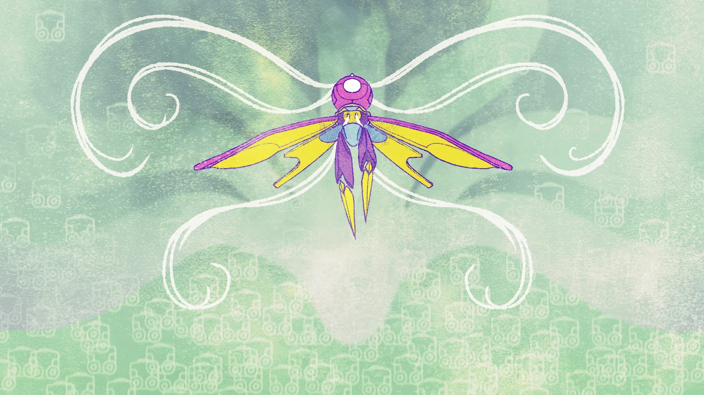
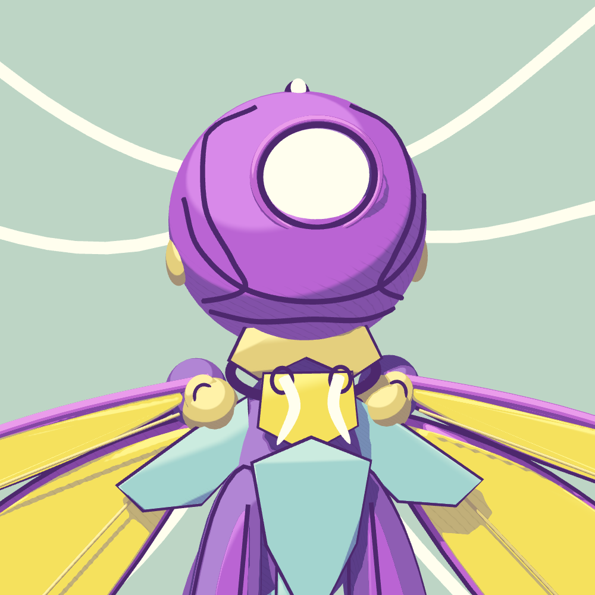
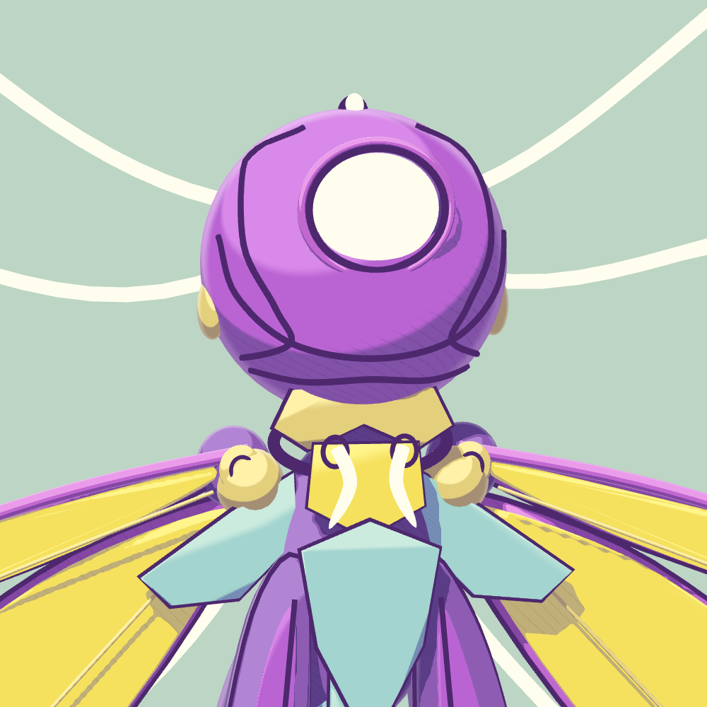
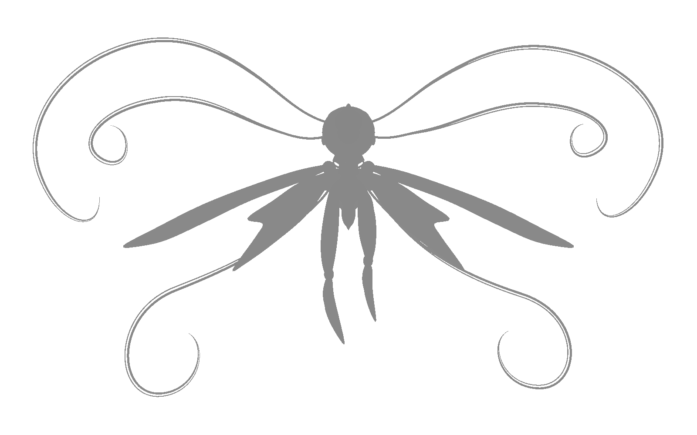
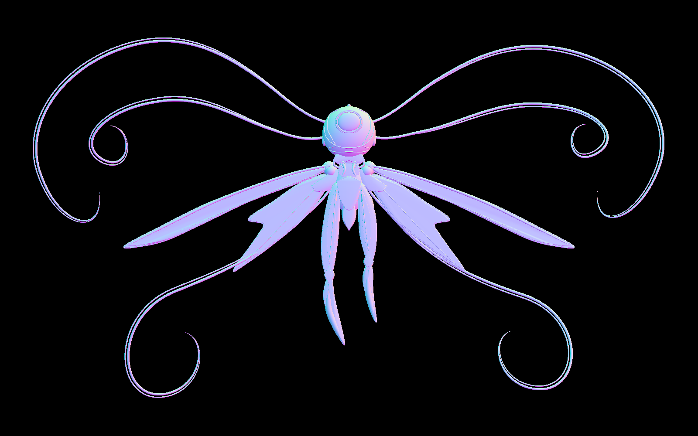
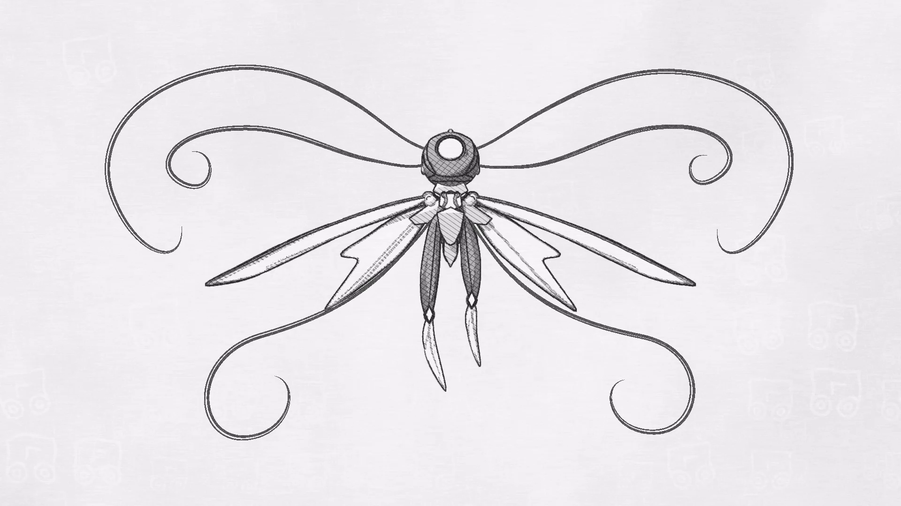
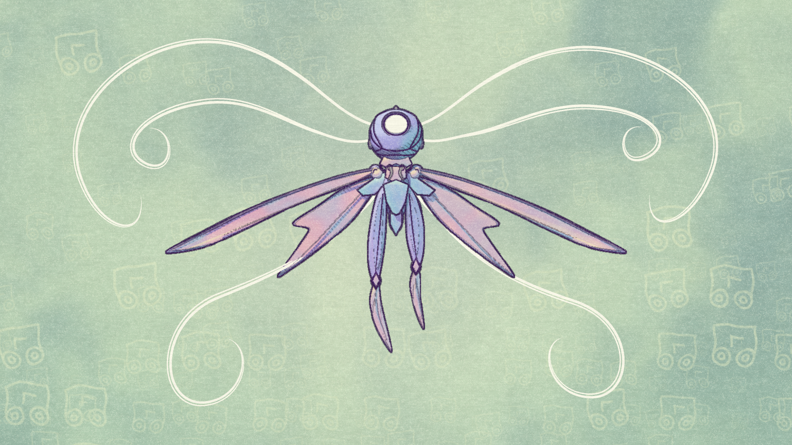

# HW 2: 3D Stylization — MIO / Shii

A real-time Unity study of Raphaëlle Colin's **Mio: Memories in Orbit — Shii** concept art. The scene combines a violet/yellow toon palette, pencil-hatched shadows, animated outlines, moving ivory filaments, and a patterned paper finish. Press **Space** to cycle through color paper, graphite sketch, and a new MIO-inspired Dream Palette surface shader.

[**Watch the 36-second turnaround video**](Videos/MIO/MIO-Turnaround-1080p.mp4) · [Original assignment instructions](docs/ASSIGNMENT.md)

## Open and run

- **Unity:** 2022.3.62f2. **Universal Render Pipeline:** 14.0.12. Validation and video capture used Windows / Direct3D 11.
- Open this repository as a project in Unity Hub and allow package import and shader compilation to finish.
- Open [MIO Interactive Study](Assets/Scenes/MIO%20Interactive%20Study.unity) for the fixed front composition, or [MIO Showcase](Assets/Scenes/MIO%20Showcase.unity) for the automatic turnaround.
- Enter **Play**, click the **Game** view, and use the controls below. A **16:9** Game view gives the intended showcase framing. The saved scenes and assets are ready to use; regeneration is unnecessary.

| Input | Interactive Study | Showcase |
| --- | --- | --- |
| Space | Cycle color paper → graphite → Dream Palette | Cycle the same three styles; manual selection lasts until restart or the next loop |
| P | — | Pause/resume the camera sequence; shader animation continues |
| R | — | Restart the camera sequence in color |

## 1. Concept art and visual direction

**Artist:** [Raphaëlle Colin](https://raphaelle_colin.artstation.com/projects/BkbRor), *Mio: Memories in Orbit — Shii*. Original character/game: **MIO: Memories in Orbit**, Douze Dixièmes. The downloaded reference is included below for attribution and comparison.

The rendering follows the reference's dark violet contour lines, saturated violet and yellow armor, cyan accents, luminous ivory curves, and pale mint/sage background. The background's repeated symbols and grain informed the procedural backdrop and paper shaders. The model's side and back are interpretations of the front-view illustration.

## 2. Interesting surface shaders

### Improved toon shader

[MIO Toon.shadergraph](Assets/Shaders/MIO/MIO%20Toon.shadergraph) extends the Lab 03 toon shader through [MIOLighting.hlsl](Assets/Shaders/MIO/MIOLighting.hlsl).

- **Multiple lights:** combines the main light and URP Forward additional lights, including distance and shadow attenuation, before mapping illumination into the toon palette. A directional key and a point fill light are present in the character scene. Light intensity is evaluated as luminance to preserve the chosen material colors.
- **Additional lighting feature:** a view-dependent soft rim, weighted by illumination, highlights curved armor and wing edges. Rim color, strength, start, and softness are exposed.
- **Custom shadow texture:** an original, repeating pencil-stroke texture is generated by [MIOFoundation.cs](Assets/Editor/MIOFoundation.cs) and saved as [MIO Hatching.png](Assets/Textures/MIO/MIO%20Hatching.png). Its periodic construction makes it tile seamlessly. It is sampled using **object UV0**, with an exposed **Shadow Scale** per material, so strokes remain attached to the geometry as the camera moves.
- **Palette:** separately authored highlight, midtone, and shadow colors retain yellow wing faces, violet armor, cyan details, and ivory filaments. The pencil texture darkens shaded regions rather than brightening shadows.

The final pencil strokes are broader without increasing their frequency; character materials use Shadow Scale 2–3 and hatching strength 0.90–0.98.

| Rim off — isolated surface study | Rim on — isolated surface study |
| --- | --- |
|  |  |

### Special surface shader: vertex animation

[MIO Living Filaments.shadergraph](Assets/Shaders/MIO/MIO%20Living%20Filaments.shadergraph) is a second surface shader derived from the improved toon graph. It implements **option 2, vertex animation**, using [MIOFilamentWave.hlsl](Assets/Shaders/MIO/MIOFilamentWave.hlsl).

The 12 long filaments sway with sine/cosine waves. A smooth root mask keeps their attachment points fixed. UV1 stores distance along each curve and its gradient; UV0 remains available for surface texturing. Normals and tangents follow the deformation so lighting and the normal buffer match the animated geometry. Amplitude, speed, wave count, and phase are adjustable.

## 3. Animated depth/normal outlines

The starter [Full Screen Feature.cs](Assets/Render%20Settings/Render%20Features/Full%20Screen%20Feature.cs) now renders through a temporary RTHandle and blits the result back to camera color. The outline system uses **separate buffers**:

- Camera depth provides silhouette/discontinuity information.
- [NormalFeature.cs](Assets/Render%20Settings/Render%20Features/NormalFeature.cs) captures the materials' native DepthNormals passes, including animated vertices, then resolves them into the supplied **Normal Buffer** render texture. RGB stores encoded view normals; alpha marks geometry and outline eligibility. Depth is not packed into this texture. Its resolution follows the camera target.

[MIO Edge Mask.shader](Assets/Shaders/MIO/MIO%20Edge%20Mask.shader) detects depth and normal changes with Roberts Cross. [MIO Animated Outlines.shadergraph](Assets/Shaders/MIO/MIO%20Animated%20Outlines.shadergraph) and [MIOOutlines.hlsl](Assets/Shaders/MIO/MIOOutlines.hlsl) composite violet ink with independently adjustable depth/normal widths, thresholds, and strengths.

Depth contours wobble with noise evaluated at stepped time (8 updates per second); normal creases remain steady. Detection uses fixed sampling footprints, and a separate dilation stage widens existing edges. Increasing line width therefore does not introduce newly detected creases. The final depth/normal widths are 3 / 1.8 and overall ink strength is 0.94.

The ivory filaments retain their light color: rendering layer 128 marks them for exclusion from dark outlines while retaining their animated normal data. Outline debug views expose depth, normals, each edge map, and their combination.

| Separate depth buffer | Separate normal buffer |
| --- | --- |
|  |  |

## 4. Full-screen paper and patterned background

[MIO Memory Backdrop.shadergraph](Assets/Shaders/MIO/MIO%20Memory%20Backdrop.shadergraph) draws mint, sage, and cream washes using domain-warped noise. Pale motifs made from circles and bent segments vary in scale, rotation, and opacity. They become denser near the bottom and quieter behind the character. The backdrop is generated procedurally rather than displaying the reference image.

[MIO Paper Grain.shadergraph](Assets/Shaders/MIO/MIO%20Paper%20Grain.shadergraph), with [MIOMemoryPaper.hlsl](Assets/Shaders/MIO/MIOMemoryPaper.hlsl), adds multi-scale paper tooth, fibers, and uneven pigment across **both the character and background**. The screen-space texture stays stationary as animation advances. Paper Strength, Grain Scale, and Fiber Strength are exposed.

The render order is: **procedural background → opaque character → normal capture → edge mask → animated ink → paper/graphite finish**. Rendering the background before geometry preserves the character's antialiased silhouette.

## 5. Scene and geometry

The scene uses the [MIO Character prefab](Assets/Models/MIOCharacter/MIO%20Character.prefab), constructed by [MIOCharacterBuilder.cs](Assets/Editor/MIOCharacterBuilder.cs). Separate helmet, torso, wing, limb, and filament meshes provide UVs, normals, and tangents for the shaders. The generated geometry contains **113 meshes, 44,762 vertices, and 78,712 triangles**. These are newly constructed study meshes, not extracted game assets.

The final composition uses an orthographic camera, a directional light, a point fill light, and the procedural backdrop. Earlier `MIO Material`, `Character`, `Shader`, `Outline`, and `Paper Study` scenes remain available to inspect individual stages.

## 6. Interactivity: graphite sketch mode

[MIOStyleSwitcher.cs](Assets/Scripts/MIOStyleSwitcher.cs), attached to the main camera, listens for **Space** through `Input.GetKeyDown`. It selects the final full-screen material for the current mode; Dream Palette additionally swaps solid-surface material assignments. Shared material assets are not edited by runtime switching.

Graphite mode uses a **new material and a new shader**, [MIO Graphite Sketch.shadergraph](Assets/Shaders/MIO/MIO%20Graphite%20Sketch.shadergraph), backed by [MIOGraphite.hlsl](Assets/Shaders/MIO/MIOGraphite.hlsl). It reconstructs five tonal bands, adds three directions of pencil strokes according to darkness, varies their curvature and dryness, converts ivory filaments into graphite lines using the normal-buffer mask, and applies neutral paper texture. This changes the rendering technique as well as removing color.

The original object-UV shadow texture, outlines, and vertex animation remain active. The additional graphite crosshatching is a screen-space post effect. The next Space press selects Dream Palette; the third returns to Color Paper. Both original styles retain their appearance.

## 7. Extra-credit candidate: textured Dream Palette

[MIO Dream Palette.shadergraph](Assets/Shaders/MIO/MIO%20Dream%20Palette.shadergraph) is a separate surface shader derived from the improved toon graph. It takes the lavender/blue, cyan, peach, and cream palette from the [additional user-supplied gameplay reference](docs/references/mio-gameplay-palette.png). This is a new interpretation of the game's colors, not its original shader or extracted assets.

- **RGB texture support:** an exposed Pigment Map samples the original [MIO Dream Pigment texture](Assets/Textures/MIO/MIO%20Dream%20Pigment.png) in UV0. Texture influence and UV scale are independent controls. The texture is generated with periodic functions and imported as an sRGB, repeating, mipmapped color texture.
- **Procedural coloring:** [MIODreamPalette.hlsl](Assets/Shaders/MIO/MIODreamPalette.hlsl) combines object-space domain-warped noise, warm highlight blooms, cool cyan pigment pooling, and independently authored light/middle/shadow colors. It changes hue and saturation in relation to lighting rather than multiplying a base color by a brightness factor.
- **Integration:** six new surface materials replace the character's solid surfaces in Dream mode. Additional lights, rim lighting, UV shadow hatching, paper, and outlines remain active. Ivory filaments retain their animated shader. The controller restores the original assignments on returning to another mode or being disabled during Play.

This is submitted for the first suggested extra-credit option: texture support with appealing procedural coloring. Final extra-credit evaluation is at the instructors' discretion. [MIODreamStage.cs](Assets/Editor/MIODreamStage.cs) builds the assets and provides isolated texture-off and wash-off comparisons.

## BGM

A project-root `BGM/` folder is reserved for the user-selected music file. Audio has not yet been integrated; the current turnaround is silent.

## Turnaround video

[MIO-Turnaround-1080p.mp4](Videos/MIO/MIO-Turnaround-1080p.mp4) is **36 seconds, 1920 × 1080, 30 fps, H.264**, with no audio.

| Time | Demonstration |
| --- | --- |
| 0–2 s | Color front view |
| 2–18 s | One uninterrupted 360° orbit |
| 18–20 s | Return to the front |
| 20–25 s | Graphite mode, followed by a small camera move |
| 25–32 s | Dream Palette, moving between three-quarter views |
| 32–36 s | Restore color and return to the front |

The recording contains 1080 frames rendered from the Unity scene, with camera and shader animation sampled at 1/30-second intervals. Scheduled style cuts use the same material selection as the interactive controller; physical keyboard input is not recorded. The Showcase scene runs this sequence live using [MIOShowcaseOrbit.cs](Assets/Scripts/MIOShowcaseOrbit.cs).

To regenerate the video, exit Play mode and select **HW02 MIO → 11 - Export 36 second 1080p showcase video**. [MIOShowcaseStage.cs](Assets/Editor/MIOShowcaseStage.cs) uses Unity's built-in MediaEncoder and overwrites the MP4 at the path above. No external encoder package is required by the project.

## Validation and scope

The following reports document checks performed during development:

| Area | Evidence |
| --- | --- |
| Surface shaders | [Rim, animation, and shader compilation checks](Screenshots/MIO/Shaders/shader-validation.txt); [UV hatching checks](Screenshots/MIO/Hatching/hatching-validation.txt) |
| Outlines | [Separate buffer alignment, independent edges, width, and animation checks](Screenshots/MIO/Paper/outline-validation.txt) |
| Paper/background | [Stable grain, foreground preservation, wider ink, and multiple resolutions](Screenshots/MIO/Paper/paper-validation.txt) |
| Interactivity | [Rendered material switching](Screenshots/MIO/Interactivity/render-validation.txt); [Play-mode lifecycle and unchanged shared assets](Screenshots/MIO/Interactivity/play-mode-validation.txt) |
| Dream Palette | [Shader, texture, wash, light, and restoration checks](Screenshots/MIO/Dream/dream-validation.txt); [Play-mode switching](Screenshots/MIO/Dream/play-mode-validation.txt) |
| Geometry | [Mesh, UV, normal, and triangle checks](Screenshots/MIO/Character/geometry-validation.txt) |
| Video | [360° framing and shader checks](Screenshots/MIO/Showcase/showcase-validation.txt); [1080 decoded frames, zero errors](Screenshots/MIO/Showcase/video-verification.json) |

Automated Play-mode checks invoke the same handler used by keyboard input; they do not inject physical OS keypresses. Earlier study screenshots and task notes document their respective development stages; the Showcase images and video show the final appearance. This implementation targets the project's URP Forward configuration; other graphics APIs and deployment platforms have not been validated.

Tasks 1–6 and the turnaround are implemented. The new Dream Palette shader is included as an extra-credit candidate; see section 7.

## Credits and source

- **Concept and character:** [Raphaëlle Colin — Mio: Memories in Orbit — Shii](https://raphaelle_colin.artstation.com/projects/BkbRor), Douze Dixièmes / MIO: Memories in Orbit. The reference artwork and underlying character remain credited to their creators.
- **Starting code:** [CIS 5660 HW02 starter](https://github.com/CIS-5660-Fall-2026/hw02-stylization) and the preceding Lab 03 toon-shading work.
- **Implementation:** project-local procedural geometry, hatching texture, backdrop motifs, surface/full-screen shaders, interaction scripts, and capture utilities are included under `Assets/`. Editor builders and validation utilities are under `Assets/Editor/`; scenes are under `Assets/Scenes/`.
- **API references:** [Shader Graph Custom Functions](https://docs.unity3d.com/Packages/com.unity.shadergraph@14.0/manual/Custom-Function-Node.html), [URP RTHandle blitting](https://docs.unity3d.com/Packages/com.unity.render-pipelines.universal@14.0/manual/customize/blit-to-rthandle.html), and [Unity MediaEncoder](https://docs.unity3d.com/2022.3/Documentation/ScriptReference/Media.MediaEncoder.html).
